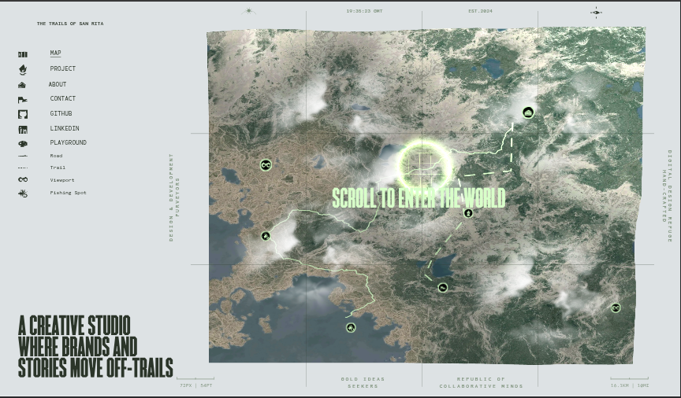
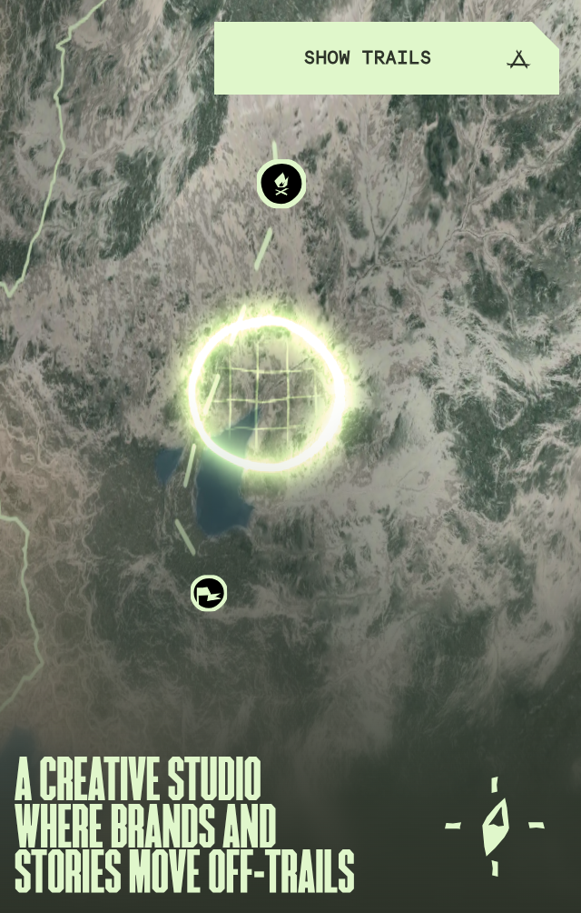

# Gamified 3D Map Navigation

An interactive, gamified 3D navigation bar designed to replace traditional static nav menus with an adventure-map experience. Built with **React Three Fiber**, **GSAP**, and **GLSL Shaders**.

---

## 🗺️ Visual Overview

| Desktop Map | Mobile Map |
| :---: | :---: |
|  |  |

---

## 💡 Core Concept

Instead of selecting destinations from a traditional 2D drop-down, users navigate through an interactive **3D terrain map**.
* **Interactive Exploration**: Drag, hover, and glide across a dynamic 3D landscape.
* **Adventure Map Pins**: Navigation destinations are marked by reactive pins that scale, reveal details, and present tooltips upon hover.
* **Cinematic Experience**: Shaders, weather patterns, and camera movements create a rich, immersive ambient background.

---

## 🛠️ Tech Stack

* **Frontend Framework**: React 19 + TypeScript + Vite
* **3D Rendering**: React Three Fiber (R3F) & Three.js
* **Physics & Effects**: Custom GLSL Vertex/Fragment Shaders (Height Map & Cloud shader simulations)
* **Animation & Motion**: GSAP (GreenSock Animation Platform) + `@gsap/react`
* **Scroll & Physics**: Lenis for smooth momentum-scrolling
* **Styling**: Tailwind CSS

---

## ⚡ Main Features

* **Dynamic Shaders**: A custom heightmap/displacement shader simulates organic terrain interactions.
* **Blob Simulation**: Interactive fluid forces warp the map geometry under the pointer.
* **Smooth Camera Rigging**: GSAP coordinates camera transitions, rotation changes, and drag response seamlessly.
* **Responsive Layout**:
  * **Desktop**: Features grid lines, a compass overlay, and coordinate-aligned borders.
  * **Mobile**: Optimized touch interactions, simplified shader execution, and a responsive viewport camera.
* **Ambient Cloud layer**: Custom cloud simulation that shifts dynamically relative to scroll position.

---

## 🚀 Getting Started

### Prerequisites

Ensure you have [pnpm](https://pnpm.io/) installed.

### Installation

1. Clone the repository and navigate to the directory:
   ```bash
   pnpm install
   ```

2. Start the development server:
   ```bash
   pnpm dev
   ```

3. Open `http://localhost:5173` in your browser.
